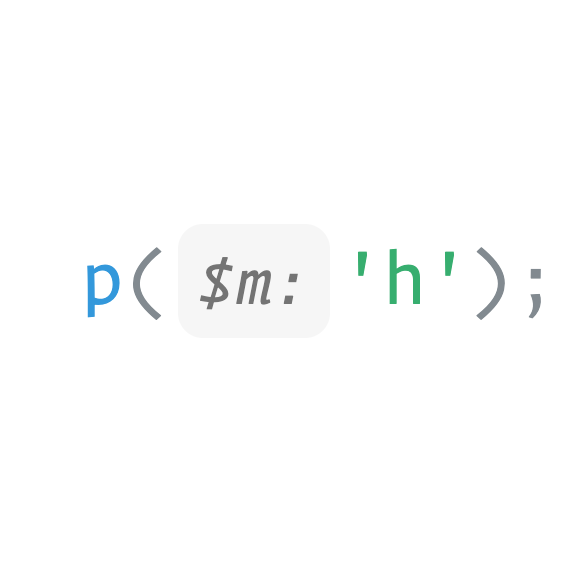

# Parameter Hints

Shows the parameter name of the called function

&nbsp;
&nbsp; 

## Supported languages *
- Javascript
- Javascript React
- Typescript
- Typescript React
- PHP

&nbsp; 
\* _Feel free to contribute_

&nbsp;
&nbsp; 

## Settings

|Name|Description|Default|
---|---|---
|`parameterHints.enabled`|Enable Parameter Hints|`true`|
|`parameterHints.hintingType`|Enable Parameter Hints Type|`variableAndType`|
|`parameterHints.languages`|Enable Parameter Hints only for the selected languages|`all`|
|`parameterHints.padding`|Padding|`1 4`|
|`parameterHints.margin`|Margin|`0 1`|

&nbsp;
&nbsp;

## Colors

| Name | Description |
---|---
|`parameterHints.hintForeground`|Specifies the foreground color for the hint|
|`parameterHints.hintBackground`|Specifies the background color for the hint|

&nbsp;
&nbsp;

## Commands

|Name|Description|
---|---
|`parameterHints.toggle`|Hide / Show Hints|

&nbsp;
&nbsp;

## Credits
[Dash-AST](https://github.com/goto-bus-stop/dash-ast)  
[TypeScript](https://github.com/microsoft/typescript/)   
[php-parser](https://github.com/glayzzle/php-parser)